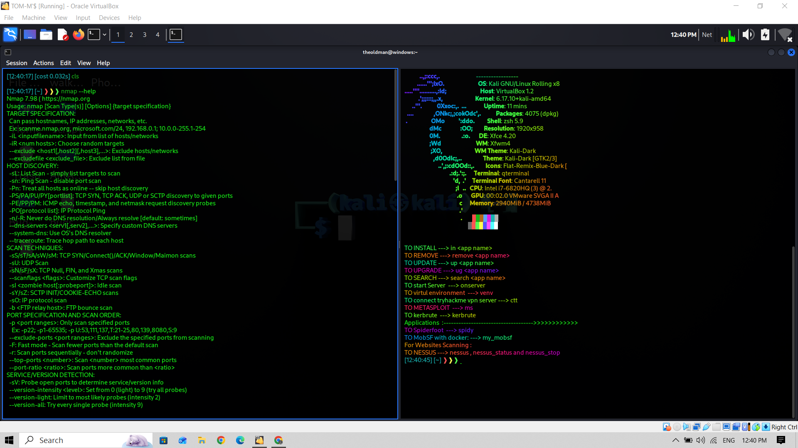
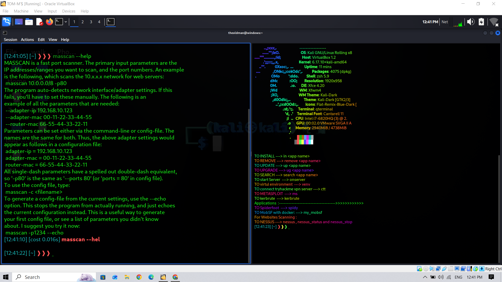
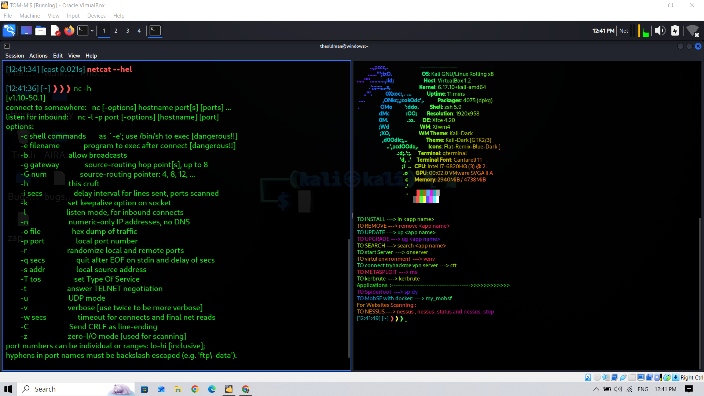
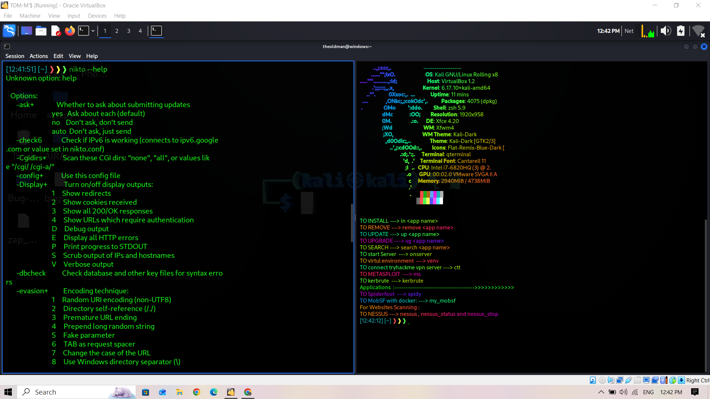
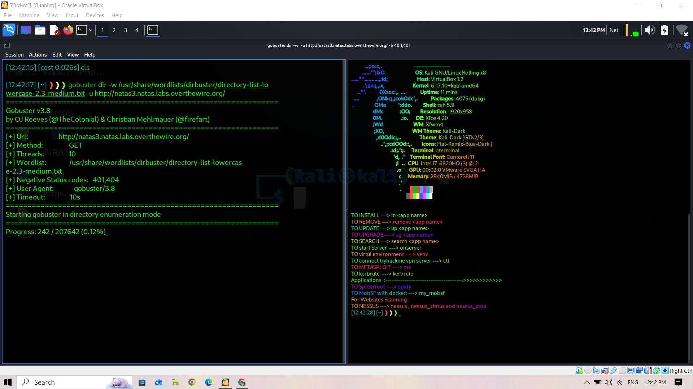
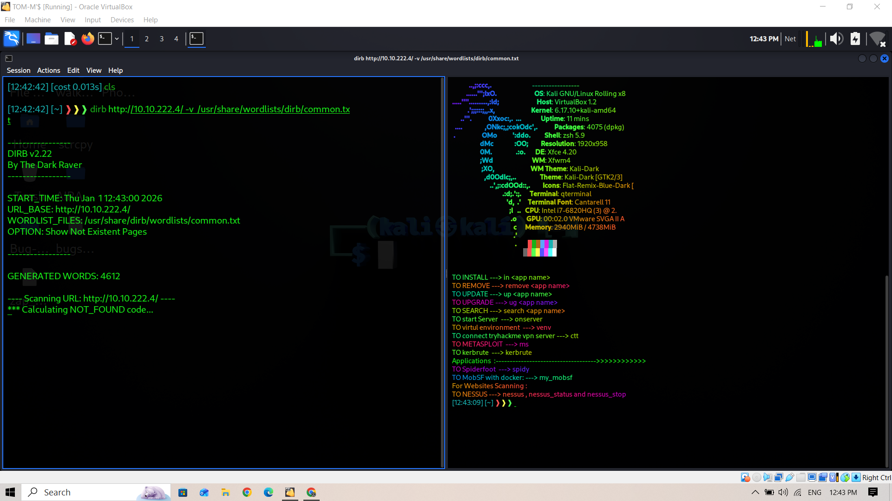
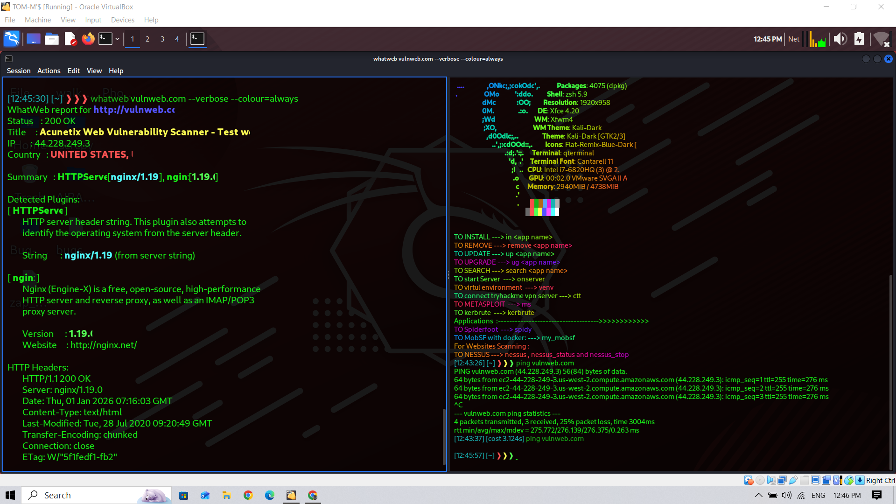
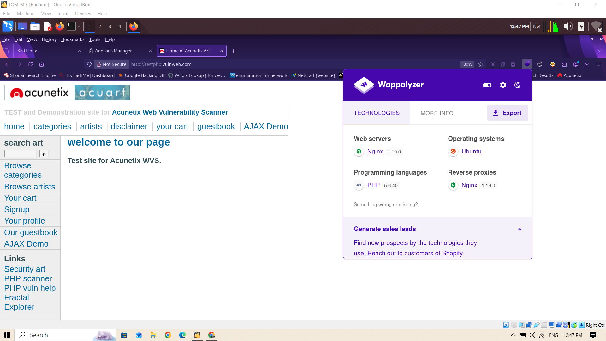

# Active Reconnaissance

## 📌 Category Reconnaissance

---

## 🧠 What is Active Reconnaissance?
Active reconnaissance involves **direct interaction with the target systems** to gather technical information such as open ports, running services, and operating systems.

⚠️ Unlike passive recon, active recon **can be detected and logged**.

---

## 🎯 Objectives
- Identify live hosts
- Discover open ports
- Enumerate running services
- Detect operating system and versions
- Map the network attack surface

---

## 🧰 Tools Used in Active Reconnaissance

---

### 🧭 Nmap
**Description:**  
Industry-standard network scanning tool used for host discovery, port scanning, service enumeration, and OS detection.

---

### ⚡ Masscan
**Description:**  
High-speed port scanner designed for large-scale scanning and quick discovery of open ports.

---

### 🔌 Netcat
**Description:**  
Versatile networking utility used for banner grabbing, port interaction, and basic service verification.

---

### 🕵️ Nikto
**Description:**  
Web server scanner that identifies outdated software, misconfigurations, and known vulnerabilities.

---

### 📂 Gobuster
**Description:**  
Brute-forces directories, files, and DNS names to identify hidden or unlinked resources.

---

### 📂 Dirsearch
**Description:**  
Advanced web path brute-forcing tool used to discover hidden directories and files.

---

### 🌐 WhatWeb
**Description:**  
Identifies web technologies such as frameworks, CMS, server types, and libraries.

---

### 🔍 Wappalyzer
**Description:**  
Browser-based tool for detecting frontend and backend technologies used by web applications.

---

## 🛡️ Detection & Defense (Blue Team View)
- IDS/IPS alerts for scanning behavior
- Firewall and WAF logs
- Rate limiting and IP blocking
- Network segmentation
- Service hardening and patching

---

## ⚠️ Legal & Ethical Notice
All active reconnaissance activities are performed **only in authorized lab environments** such as:
- TryHackMe
- Hack The Box
- Local test labs

Unauthorized scanning of real-world systems is illegal.

---

## 📝 Notes
Active reconnaissance provides deeper technical insight but increases the risk of detection.  
Effective attackers balance **information gained vs. noise generated**.

