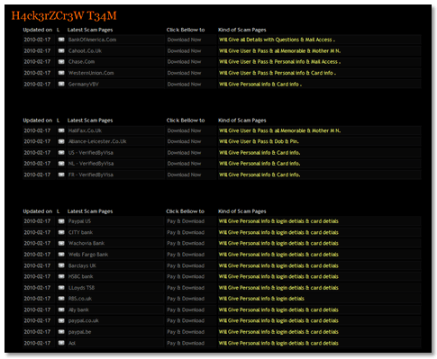
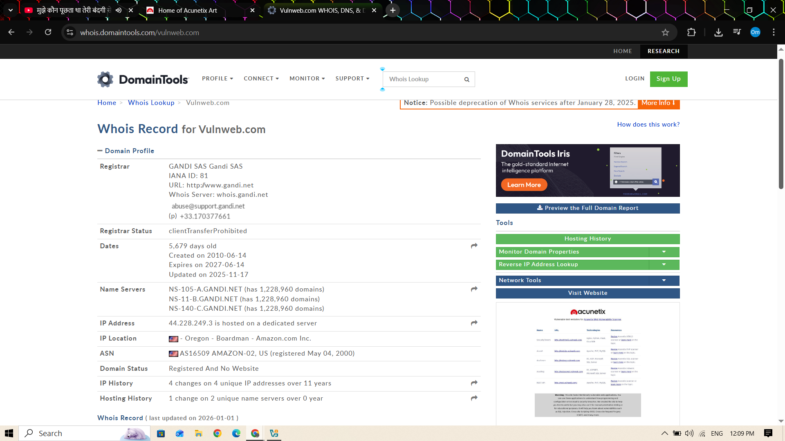
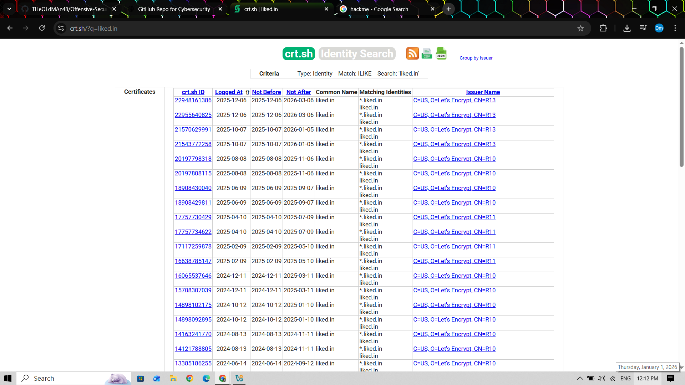
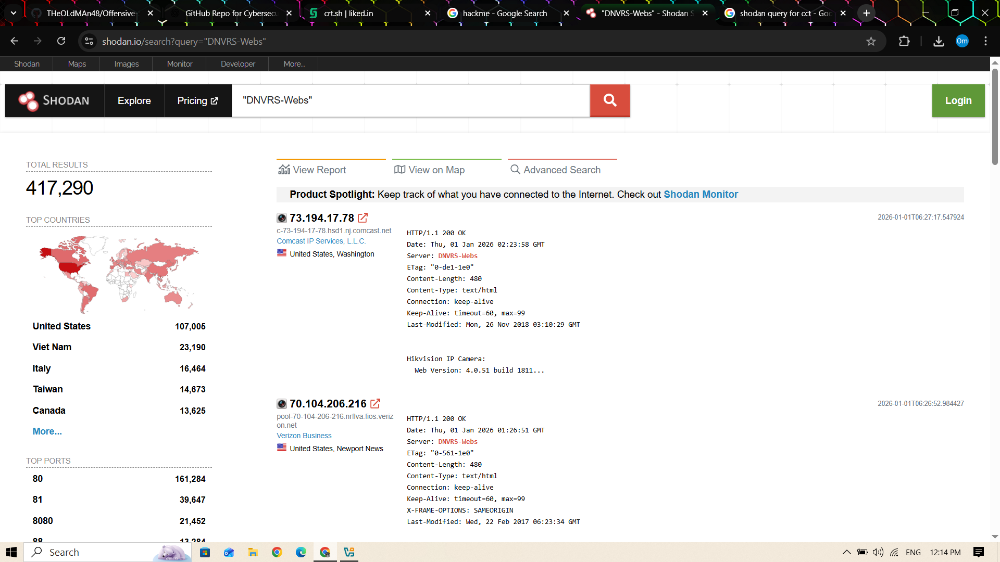
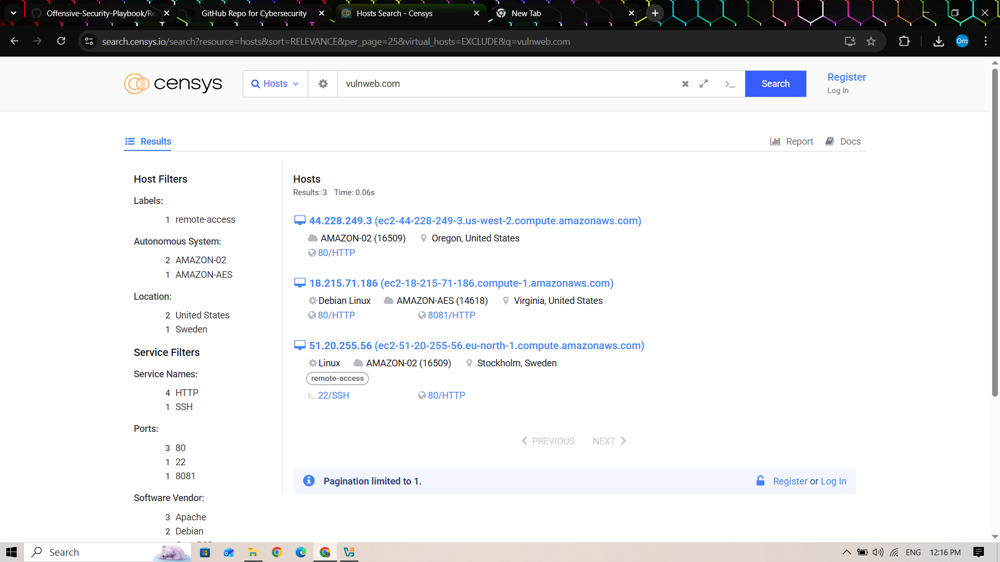
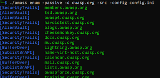
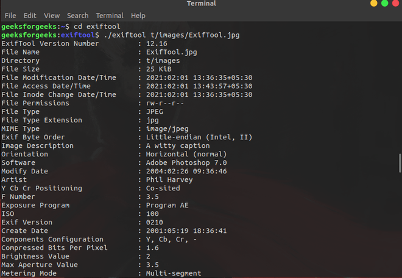

# Passive Reconnaissance

## 📌 Category
### Reconnaissance

---

## 🧠 What is Passive Reconnaissance?
Passive reconnaissance is the process of gathering information about a target **without directly interacting** with its systems.  
The objective is to collect maximum intelligence while remaining **stealthy and undetected**.

Passive recon relies heavily on **OSINT (Open Source Intelligence)**.

---

## 🎯 Objectives
- Identify domains and subdomains
- Discover IP ranges and hosting details
- Understand technology stack
- Collect publicly available organizational data
- Reduce detection risk in early attack phases

---

## 🧰 Tools Used in Passive Reconnaissance

---

### 🔍 Google Dorking
**Description:**  
Uses advanced search operators to discover sensitive or interesting information indexed by search engines.

---

### 🌍 WHOIS
**Description:**  
Provides domain registration details such as registrar, organization, name servers, and creation dates.

---

### 📡 crt.sh (Certificate Transparency)
**Description:**  
Extracts subdomains and hostnames from publicly logged SSL/TLS certificates.

---

### 🛰️ Shodan
**Description:**  
Search engine for internet-exposed devices, services, ports, and technologies using passive data collection.

---

### 🛰️ Censys
**Description:**  
Indexes hosts, certificates, and services across the internet to analyze external attack surface.

---

### 🧠 theHarvester
**Description:**  
Collects emails, subdomains, and hosts from public sources such as search engines and PGP servers.

---

### 🧬 Amass (Passive Mode)
**Description:**  
Performs passive subdomain enumeration using multiple OSINT data sources.

---

### 📄 ExifTool
**Description:**  
Extracts metadata from public documents to reveal usernames, software versions, and timestamps.

---

### 🧑‍💻 GitHub Search
**Description:**  
Identifies exposed domains, configuration files, API references, and sensitive information in public repositories.

---

## 🛡️ Detection & Defense (Blue Team View)
- Limit publicly exposed information
- Monitor certificate transparency logs
- Prevent sensitive data leaks in public repositories
- Apply proper metadata sanitization
- Implement OSINT exposure monitoring

---

## ⚠️ Legal & Ethical Notice
All reconnaissance activities documented here are performed **only in authorized lab environments** such as:
- TryHackMe
- Hack The Box
- OWASP Juice Shop
- Test domains

Unauthorized reconnaissance on real-world targets is illegal.

---

## 📝 Notes
Passive reconnaissance is the **foundation of every attack lifecycle**.  
Strong defenders minimize what attackers can learn without direct access.
