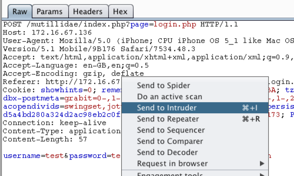
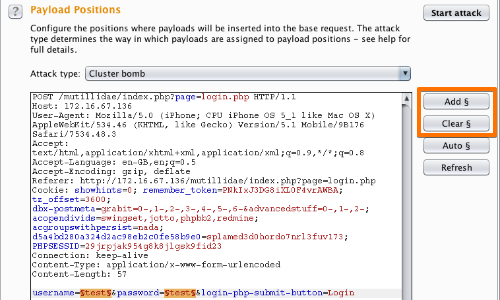
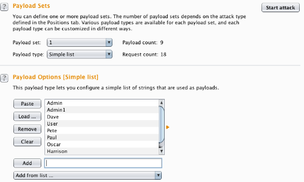
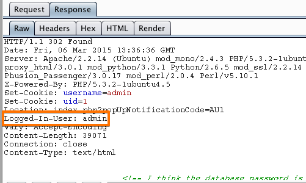

# Authentication Bypass

## 📌 Category
Web Application Attack

---

## 🧠 What is Authentication Bypass?
Authentication Bypass occurs when an attacker is able to **access protected functionality without valid credentials**, due to logic flaws, misconfigurations, or weak authentication mechanisms.

---

## 🎯 Impact
- Unauthorized account access
- Admin panel takeover
- Privilege escalation
- Data exposure

---

## 🧪 Lab Environment
> Practiced strictly in authorized labs:
- TryHackMe Authentication Rooms
- PortSwigger Authentication Labs
- OWASP Juice Shop
- Custom vulnerable apps

---

## 🔍 Common Auth Bypass Scenarios
- Weak session handling
- Predictable tokens
- Missing authentication checks
- Parameter manipulation
- Default credentials

---

## 🛠️ Tools Used

- Burp Suite
### Step1

### Step2

### Step3

### Step4

---

## ⚙️ Attack Methodology (Lab Only)
1. Capture authenticated request
2. Logout & replay request
3. Modify headers/cookies
4. Remove auth tokens
5. Observe access without login

---

## 📸 Proof of Concept
- Request with/without authentication
- Unauthorized response screenshot
- Session token reuse

---

## 🚨 Detection Techniques
- Session anomaly detection
- Repeated unauthorized access attempts
- API gateway logging
- MITRE ATT&CK: T1078 (Valid Accounts Abuse)

---

## 🛡️ Mitigation & Prevention
- Strong authentication enforcement
- Session expiration & rotation
- MFA implementation
- Server-side authorization checks

---

## 📚 References
- OWASP Authentication Cheatsheet
- PortSwigger Labs
- TryHackMe Rooms

---

## 📝 Notes
Most authentication bypasses occur due to **logic flaws**, not cryptographic weaknesses.
