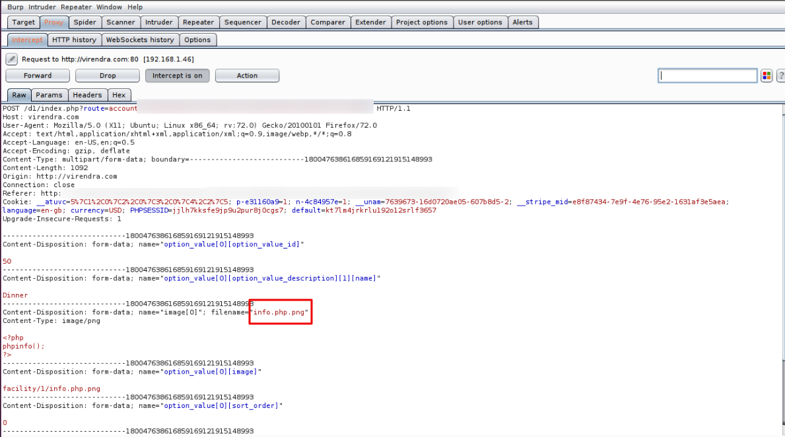

# File Upload Vulnerabilities

## 📌 Category
Web Application Attack

---

## 🧠 What is File Upload Vulnerability?
A File Upload vulnerability occurs when an application allows users to upload files **without proper validation**, enabling attackers to upload malicious files such as web shells.

---

## 🎯 Impact
- Remote Code Execution (RCE)
- Web shell access
- Server compromise
- Data exfiltration

---

## 🧪 Lab Environment
> Practiced strictly in legal labs:
- TryHackMe File Upload Rooms
- OWASP Juice Shop
- DVWA
- Custom test servers

---

## 🔍 Common Weaknesses
- No file type validation
- Trusting client-side validation
- Improper MIME checks
- Upload directory executable

---

## 🛠️ Tools Used

- Burp Suite  

---

## ⚙️ Attack Methodology (Lab Only)
1. Upload normal file to observe behavior
2. Modify file extension (`.php.jpg`)
3. Bypass MIME validation
4. Upload payload
5. Access uploaded file endpoint

---

## 📸 Proof of Concept
- Upload request screenshot
- File execution result
- Server response

---

## 🚨 Detection Techniques
- File integrity monitoring
- Upload directory scanning
- WAF alerts
- MITRE ATT&CK: T1105 (Ingress Tool Transfer)

---

## 🛡️ Mitigation & Prevention
- Whitelist file extensions
- Server-side validation
- Disable execution in upload folders
- Randomized file names
- Antivirus scanning

---

## 📚 References
- OWASP File Upload
- PortSwigger File Upload Labs
- TryHackMe Rooms

---

## 📝 Notes
File upload issues often lead directly to **RCE**, making them high-risk vulnerabilities.
