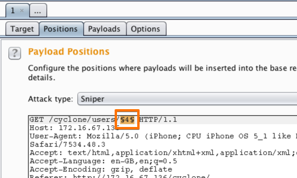
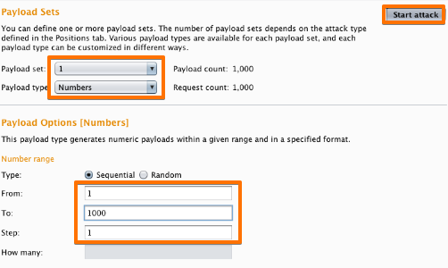
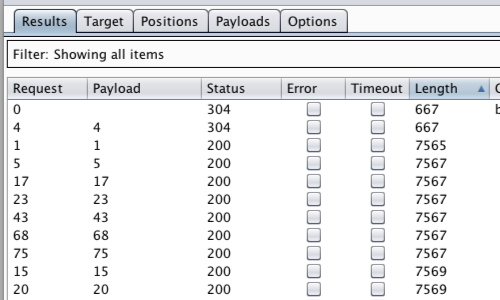
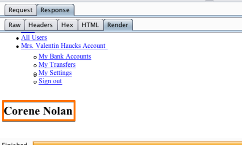

# Insecure Direct Object Reference (IDOR)

## 📌 Category
Web Application Attack

---

## 🧠 What is IDOR?
IDOR occurs when an application exposes **internal object references** (IDs, filenames, user numbers) without proper authorization checks.

Attackers can manipulate these values to access **other users’ data**.

---

## 🎯 Impact
- Unauthorized data access
- Account takeover
- Data leakage (PII)
- Business logic abuse

---

## 🧪 Lab Environment
> Practiced only in authorized environments:
- TryHackMe IDOR Rooms
- OWASP Juice Shop
- PortSwigger Labs
- Custom vulnerable APIs

---

## 🔍 Common IDOR Locations
- URL parameters (`?user_id=101`)
- API endpoints (`/api/user/123`)
- Hidden form fields
- Mobile API requests

---

## 🛠️ Tools Used

- Burp Suite

### setp 1

### setp 2

### setp 3

### setp 4

### setp 5

--- 

## ⚙️ Attack Methodology (Lab Only)
1. Intercept request
2. Identify object reference (ID)
3. Modify ID value
4. Replay request
5. Observe unauthorized access

---

## 📸 Proof of Concept
- Request before & after modification
- Response showing unauthorized data
- Screenshots of Burp/Postman output

---

## 🚨 Detection Techniques
- API logging
- Access pattern analysis
- Authorization failure alerts
- MITRE ATT&CK: T1213 (Data from Information Repositories)

---

## 🛡️ Mitigation & Prevention
- Proper authorization checks
- Use indirect object references (UUIDs)
- RBAC & ABAC enforcement
- Server-side access validation

---

## 📚 References
- OWASP IDOR
- PortSwigger IDOR Labs
- TryHackMe IDOR Room

---

## 📝 Notes
IDOR is a **logic flaw**, not a technical bug — extremely common in APIs and mobile apps.

