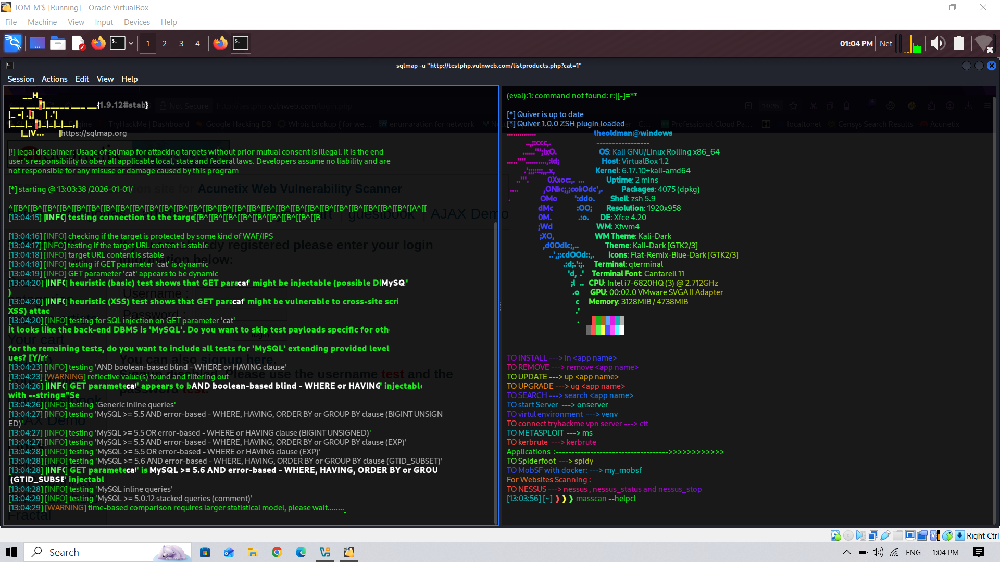
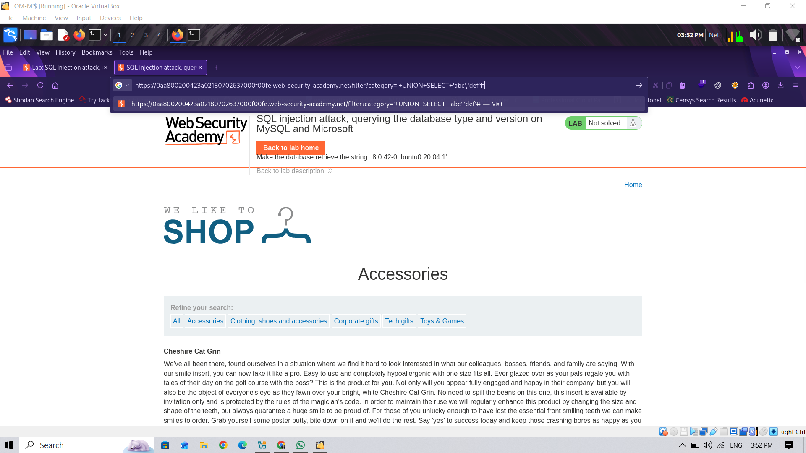

# SQL Injection (SQLi)

## 📌 Category
Web Application Attack

---

## 🧠 What is SQL Injection?
SQL Injection is a web vulnerability where an attacker can manipulate input fields to execute **arbitrary SQL queries** on the backend database.  
This can lead to **unauthorized data access, data modification, or complete database compromise**.

---

## 🎯 Why It is Dangerous
- Unauthorized access to sensitive information (usernames, passwords, credit cards)
- Bypass authentication
- Database modification or deletion
- Full system compromise if chained with other exploits

---

## 🧪 Lab Environment
> Practiced only in authorized labs:
- TryHackMe Web Challenges
- DVWA (Damn Vulnerable Web Application)
- OWASP Juice Shop
- Local test applications

---

## 🔍 Identification & Enumeration
- Look for input fields: login forms, search bars, URL parameters
- Test with `' OR '1'='1` or `' OR 1=1--`  
- Observe error messages (Database errors reveal backend)
- Automated scanners: sqlmap, Burp Suite Scanner

---

## 🛠️ Tools Used
- SQLmap  
  

- Burp Suite  
  

- Manual Testing (Browser/Forms)  
  

---

## ⚙️ Attack Methodology (Lab Only)
1. Identify input points (form, URL, cookies)  
2. Test with single quote `'` to trigger errors  
3. Inject payloads: `' OR '1'='1--`  
4. Retrieve database info: table names, columns, records  
5. Validate extraction and exploitation in lab environment

---

## 📸 Proof of Concept (Optional)
- Screenshots of form injection  
- Database enumeration output (redacted if real)  
- sqlmap console output

---

## 🚨 Detection Techniques
- WAF rules (SQLi signatures)  
- Database error logging  
- Web server monitoring for unusual query patterns  
- MITRE ATT&CK Mapping: T1190 (Exploit Public-Facing Application)

---

## 🛡️ Mitigation & Prevention
- Use prepared statements / parameterized queries  
- Input validation & sanitization  
- WAF / IDS rules for SQLi patterns  
- Minimum database privileges (least privilege principle)  
- Error messages should not reveal database structure

---

## 📚 References
- [OWASP SQL Injection](https://owasp.org/www-community/attacks/SQL_Injection)  
- [TryHackMe SQL Injection Room](https://tryhackme.com)  
- DVWA Documentation  

---

## 📝 Notes
SQLi remains one of the **most critical web vulnerabilities**.  
Strong defenses, combined with input validation, can completely prevent exploitation.
