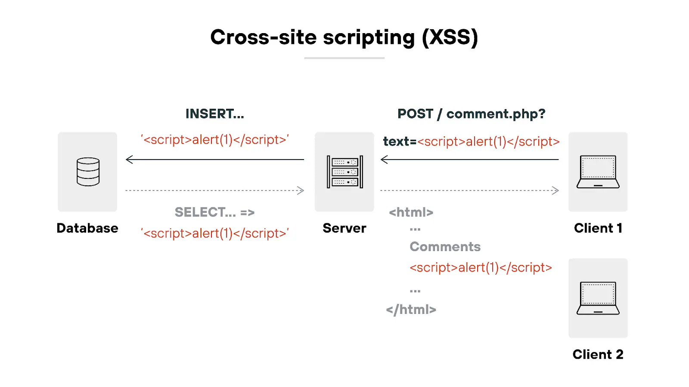
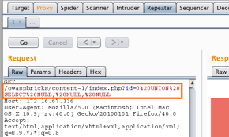
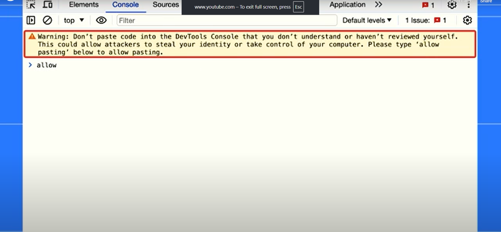
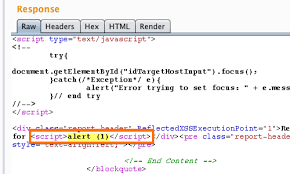

# Cross-Site Scripting (XSS)

## 📌 Category
Web Application Attack

---

## 🧠 What is XSS?
Cross-Site Scripting (XSS) is a vulnerability where an attacker injects **malicious JavaScript** into a trusted website, which then executes in the victim’s browser.

This allows attackers to:
- Steal cookies & session tokens
- Perform actions as the victim
- Deface websites
- Deliver phishing attacks

---

## 🎯 Impact
- Session hijacking
- Account takeover
- Credential theft
- Browser-based malware delivery

---

## 🧪 Lab Environment
> Practiced strictly in authorized labs:
- TryHackMe XSS Rooms
- OWASP Juice Shop
- DVWA
- PortSwigger Web Security Academy

---

## 🔍 Types of XSS

### 1️⃣ Stored XSS
- Payload stored in database
- Executes for every user
- Most dangerous

### 2️⃣ Reflected XSS
- Payload reflected in HTTP response
- Requires victim interaction (link click)

### 3️⃣ DOM-Based XSS
- Occurs on client-side JavaScript
- No server interaction

---

## 🛠️ Tools Used

- Burp Suite  

- Browser Developer Tools  

- XSStrike  

- Manual Payload Testing  

---

## ⚙️ Attack Methodology (Lab Only)
1. Identify input reflection points
2. Test basic payloads: ``
3. Bypass filters using encoding
4. Confirm execution in browser
5. Escalate to cookie/session theft (lab only)

---

## 📸 Proof of Concept
- Screenshot of alert execution
- Payload reflected in response
- Console logs (if DOM XSS)

---

## 🚨 Detection Techniques
- Web Application Firewall (WAF)
- CSP (Content Security Policy)
- Browser-based protection
- MITRE ATT&CK: T1059 (Command Execution – JS)

---

## 🛡️ Mitigation & Prevention
- Output encoding
- Input validation
- Content Security Policy (CSP)
- HttpOnly & Secure cookies
- Avoid inline JavaScript

---

## 📚 References
- OWASP XSS
- PortSwigger XSS Labs
- TryHackMe XSS Room

---

## 📝 Notes
XSS is a **client-side attack** but can lead to full account compromise when chained with session theft.
